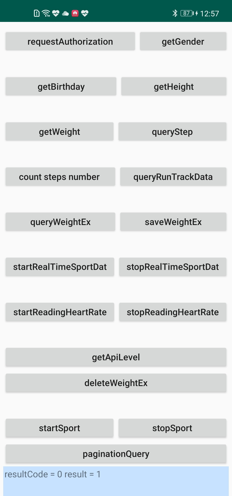

# Health Kit demo

## Table of Contents

 * [Introduction](#introduction)
 * [Getting Started](#getting-started)
 * [Supported Environments](#supported-environments)
 * [Result](#result)
 * [License](#license)

## Introduction
HUAWEI HiHealth Kit is an open service for sports & health capabilities provided by Huawei. Developers can access the HUAWEI HiHealth Kit Platform and obtain sports & health data by integrating HUAWEI HiHealth Kit.   
HiHealth Kit demo code encapsulates APIs of the HUAWEI HiHealth Kit. It provides demo programs for your reference or usage.   

Include these functions of HiHealth Kit:  
1)  Authorization  

2)  Operate health and sport data  

3)  Real time data register  

For more development details, please refer to the following link: 
https://developer.huawei.com/consumer/cn/hms/huaweihealth

## Getting Started

Before using HiHealth Kit demo code, check whether the IDE environment has been installed. 
1. Decompress the demo code package.    
2. Copy the package into the IDE directory and import it into the IDE Tool.
3. Press Sync Project with Gradle Files to ensure the development environment builds completed.

For more development details, please refer to the following link: 
https://developer.huawei.com/consumer/cn/hms/huaweihealth

## Supported Environments
* Android Studio 3.0 or later
* Java SDK 1.8 or later
* HUAWEI Health App 10.1.2.513 or later

## Result
  
  
##  License
   HiHealth kit demo is licensed under the [Apache License, version 2.0](http://www.apache.org/licenses/LICENSE-2.0).
