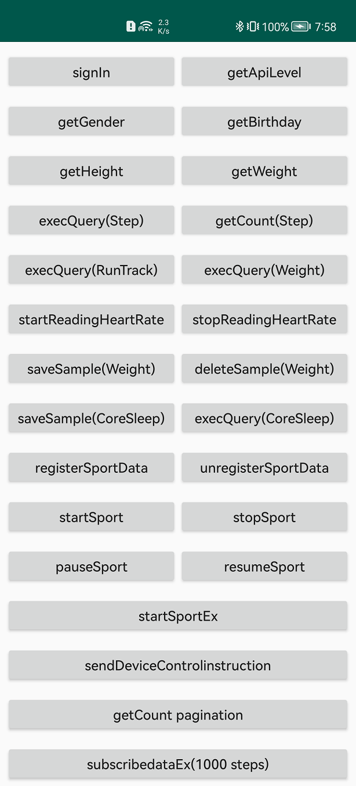

# Extended Health Kit Demo

## Table of Contents

 * [Introduction](#introduction)
 * [Getting Started](#getting-started)
 * [Supported Environments](#supported-environments)
 * [Result](#result)
 * [License](#license)

## Introduction
Extended Health Kit is an open service for sports & health capabilities provided by Huawei. Developers can access the HUAWEI Health Kit Platform and obtain sports & health data by integrating Extended Health Kit. 

Extended Health Kit Demo code encapsulates APIs of the Extended Health Kit. It provides demo programs for your reference or usage.   

Include these functions of Extended Health Kit:  
1. Operate health and sport data.
2. Real time data register.

For more development details, please refer to the following link: 
https://developer.huawei.com/consumer/en/hms/huaweihealth

## Getting Started

Before using Extended Health Kit Demo code, check whether the IDE environment has been installed. 
1. Decompress the demo code package.    
2. Copy the package into the IDE directory and import it into the IDE Tool.
3. You should also generate a signing certificate fingerprint and add the certificate file to the project, and add configuration to build.gradle. See ([Signing Certificate Fingerprint](https://developer.huawei.com/consumer/en/doc/development/HMSCore-Guides/signing-fingerprint-0000001059050363) & [Importing the Certificate Fingerprint, Changing the Package Name, and Configuring the JDK Build Version](https://developer.huawei.com/consumer/en/doc/development/HMSCore-Guides/change-0000001050170085))
4. AppId: Add the app ID generated when creating the app on HUAWEI Developers to the AndroidManifest.xml file of the app.
5. Press Sync Project with Gradle Files to ensure the development environment builds completed.

## Supported Environments
* Android Studio 3.6.1 or later
* Java SDK 1.8 or later
* HUAWEI Health App 12.1.6.300 or later

## Result
  

##  License
   Extended Health Kit Demo is licensed under the [Apache License, version 2.0](http://www.apache.org/licenses/LICENSE-2.0).